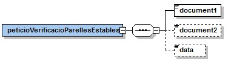

# VO - RPE (Registre de Parelles Estables)

| Versió|	Data|	Autor|	Comentaris|
|--|--|--|--|
|V1.0|	01/03/2022|	Roger Noguera i Arnau|	Creació del document|

- [1. Introducció](#1)
- [2. Transmissions de dades disponibles](#2)
- [3. Missatgeria dels serveis](#3)
   * [3.1. Situació d'un titular al Registre de Parelles Estables (RPE_CONSULTA)](#3.1)
        * [3.1.1 Petició – dades genèriques](#3.1.1)
        * [3.1.2 Petició – dades específiques](#3.1.2)
		* [3.1.3 Resposta – dades específiques](#3.1.3)
   * [3.2. Verificació d'un titular al Registre de Parelles Estables (RPE_VERIFICACIO)](#3.2)
        * [3.2.1 Petició – dades específiques](#3.2.1)
        * [3.2.2 Resposta – dades específiques](#3.2.2)
- [4. Joc de proves](#4)

# 1 Introducció 

Aquest document detalla la missatgeria associada al servei de consulta del Registre de Parelles Estables (en endavant RPE) del Departament de Justícia.

Per poder realitzar la integració cal conèixer prèviament la següent documentació:

- [Document de Missatgeria Genèrica de la PCI del Consorci AOC.][PCI]

[PCI]:https://github.com/ConsorciAOC/PCI

# 2 Transmissions de dades disponibles 

Les dades disponibles a través del servei són les que es presenten a continuació:

|EMISSOR|
|--|
|Departament de Justícia (Generalitat de Catalunya)|

|PRODUCTE|RPE|
 | --- | --- | 
 | RPE_CONSULTA | Consulta de situació d’un titular al Registre de Parelles Estables en un moment donat.|
 | RPE_VERIFICACIO | Consulta de situació d'un titular al Registre de Parelles Estables en un moment donat a partir d'un o dels dos membres de la parella. |

Totes les consultes del producte tenen disponible la versió imprimible del resultat de la consulta en format PDF. Per més detalls adreceu-vos a l'apartat Extensions de missatgeria del document de missatgeria genèrica.

# 3 Missatgeria dels serveis 
A continuació es detalla la missatgeria corresponent al bloc de dades específiques de les modalitats de consum del producte RPE.

## 3.1 Situació d'un titular al Registre de Parelles Estables (RPE_CONSULTA) 

### 3.1.1 Petició – dades genèriques 
|Element|	Descripció|
| --- | --- |
|//DatosGenericos/Titular/TipoDocumentacion	|Tipus de document identificador (cal informar l'element però el servei no el té en compte).|
| //DatosGenericos/Titular/Documentacion | Document identificador del titular a consultar. |

### 3.1.2 Petició – dades específiques 

|Element|	Descripció|
| --- | --- |
|peticioConsultaParellesEstables/data	|Bloc de dades opcional. Data en la que es vol conèixer la situació del titular al registre.	|

### 3.1.3 Resposta – dades específiques 

|Element|	Descripció |
| --- | --- |
|respostaConsultaParellesEstables/peticioConsultaParellesEstables| Bloc de dades corresponent a la petició que genera la resposta. | 
| //resposta/dataInscripcio | Data d'inscripció de la parella (AA/MM/DDDD). |
| //resposta/dataExtincio | Data d'extinció de la parella (AA/MM/DDDD). |
| //resposta/estat | Estat en el que consta al registre: <li> Inscrit<li>No inscrit|
| //resposta/membre1 | Nom i cognoms del primer membre de la parella. |
| //resposta/membre2 | Nom i cognoms del segon membre de la parella. |
| respostaConsultaParellesEstables/resultat/codiResultat | Codi de resultat de la consulta:<li>0: consulta realitzada correctament.<li>0502: error realitzant la consulta.|
| respostaConsultaPrestacions/resultat/descripció | Descripció del resultat. |

## 3.2 Verificació d'un titular al Registre de Parelles Estables (RPE_CONSULTA) 

### 3.2.1 Petició – dades específiques 

|Element|	Descripció |
| --- | --- |
|peticioVerificacioParellesEstables/document1	|Document identificador d'un membre de la parella a consultar (no es té en compte el tipus de document).	|
 | peticioVerificacioParellesEstables/document2 | Document identificador d'un membre de la parella a consultar (no es té en compte el tipus de document). | 
 | peticioVerificacioParellesEstables/data | Data en la que es vol conèixer la situació dels titulars al registre. |

### 3.2.2 Resposta – dades específiques 

|Element|	Descripció | 
| --- | --- |
|respostaVerificacioParellesEstables/peticioVerificacioParellesEstables	| Bloc de dades corresponent a la petició que genera la resposta.  |
| //resposta/dataInscripcio | Data d'inscripció de la parella (AA/MM/DDDD). |
| //resposta/dataExtincio | Data d'extinció de la parella (AA/MM/DDDD). |
| //resposta/estat | Estat en el que consta al registre: <li>Inscrit<li>No inscrit
| respostaVerificacioParellesEstables/resultat/codiResultat | Codi de resultat de la consulta: <li>0: consulta realitzada correctament.<li>0502: error realitzant la consulta.|
 | respostaVerificacioPrestacions/resultat/descripció | Descripció del resultat. |

# 4 Joc de proves 

L&#39;emissor final publica els següent [joc de proves a l&#39;entorn de pre-producció][proves] 

[proves]: http://transversals.ctti.intranet.gencat.cat/sol-pica-iop-gene/rpe/

 En cas de tindre problemes per accedir als jocs de proves, si us plau, obre un tiquet a través del [formulari][form]

[form]:https://www.aoc.cat/portal-suport/peticio-integradors/idservei/integracio/
